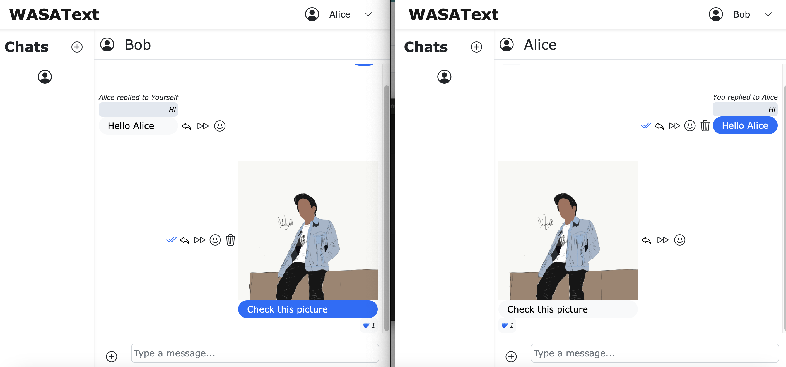

# WASAText Chat Application
## My final project in my university course named WASA(Web And Software Architecture)

> A full stack web application that lets you chat with users



## Features

- User Login
- Create conversations (Private or Group)
- Converastion Filter
- Reply to Chat
- React to Chat
- Forward Chats
- Delete Chats
- Image sending (File upload)
- User profile
- Chats made "real-time" by Polling

## Technologies Used
  <p>
      <a href="#"></a>
      <a href="#"></a>
      <a href="#"></a>
      <a href="#"></a>
      <a href="#"></a>
   
  </p>


 ## Usage

```bash
docker compose up -d
```

Open [http://localhost:5173](http://localhost:5173) with your browser to see the result.

## License

This project is licensed under the MIT License - see the [LICENSE.md](LICENSE.md) file for details

